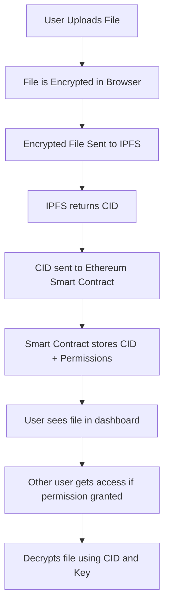

# 🔐 Encryptum

**Encryptum** is the encrypted, CID-based storage layer built for [Model Context Protocol (MCP)](https://modelcontext.org) native AI systems. It enables autonomous agents to store, retrieve, and share encrypted context using decentralized infrastructure like IPFS and Ethereum smart contracts.

> “Memory for agents. Privacy for systems. Context for intelligence.”

---

## 🌐 Live Demo

▶️ **[Launch App](https://app.encryptum.io)**

---

## 📦 Features

- 🧠 **AI Memory Layer** — Private, encrypted file storage for autonomous agents  
- 🔗 **Decentralized Storage** — Uses IPFS to distribute files across global nodes  
- 🔐 **Ethereum Smart Contracts** — Secures file metadata and permissions on-chain  
- 🧱 **Composable Context** — Files stored as CIDs for verifiable reasoning  
- 🗃️ **User-Friendly Interface** — Upload, share, and access files from your wallet  

---

### 🔄 Workflow Diagram




---

### 🔍 What this shows:
- Encryptum **encrypts files client-side** (in the browser)
- Stores them on **IPFS**
- Then registers the **CID + permissions** on Ethereum via smart contracts
- Users can **share** and **access** files with proper permissions

---

## 🔧 Installation

> ⚠️ Run these in [Replit](https://replit.com) or a local Node.js environment.

### 1. Clone the repo
```
git clone https://github.com/encryptumdev/encryptum.git
cd encryptum
```
### 2. Install dependencies
```
npm install
```
### 3. Configure `.env` file
```
PRIVATE_KEY=your_private_key_without_0x
ALCHEMY_API_KEY=your_sepolia_alchemy_api_key
```
### 4. Deploy smart contract to Sepolia
```
npx hardhat run scripts/deploy.js --network sepolia
```
### 5. Run the frontend
```
cd client
npm install
npm start
```
### 6. Using the App
1. Open the app in your browser: [http://localhost:3000](http://localhost:3000)
2. Connect your Ethereum wallet (like MetaMask) on the **Sepolia testnet**
3. Upload a file — it will be encrypted and stored on IPFS
4. You can see your uploaded files in the dashboard
5. Share files using the share button (copies CID or sends access via smart contract)

> ⚠️ Make sure you have test ETH on Sepolia — you can get it from a [faucet](https://sepoliafaucet.com/)

### 📝 Notes

- If a file doesn't show after uploading, wait a few seconds and refresh
- Make sure your wallet is on the **Sepolia network**
- If you're using an ad blocker, it might block IPFS — try disabling it
- Smart contract stores file metadata (CID + permissions), not the file itself


---

## 🤝 Contributing

1. Fork this repo  
2. Create a new branch (`git checkout -b feature/my-feature`)  
3. Commit your changes (`git commit -am 'Add new feature'`)  
4. Push to your branch (`git push origin feature/my-feature`)  
5. Submit a pull request  

---

## 📄 License

MIT — use it freely for both personal and commercial projects.

---

## 🔗 Links

- 🌐 Website: [encryptum.io](https://encryptum.io)
- 💻 GitHub: [github.com/encryptumdev](https://github.com/encryptumdev)
- 🧠 Protocol: [modelcontext.org](https://modelcontext.org)
- 🐦 Twitter: [@encryptumio](https://twitter.com/encryptumio)

---

> Built for the future of AI-native systems.
