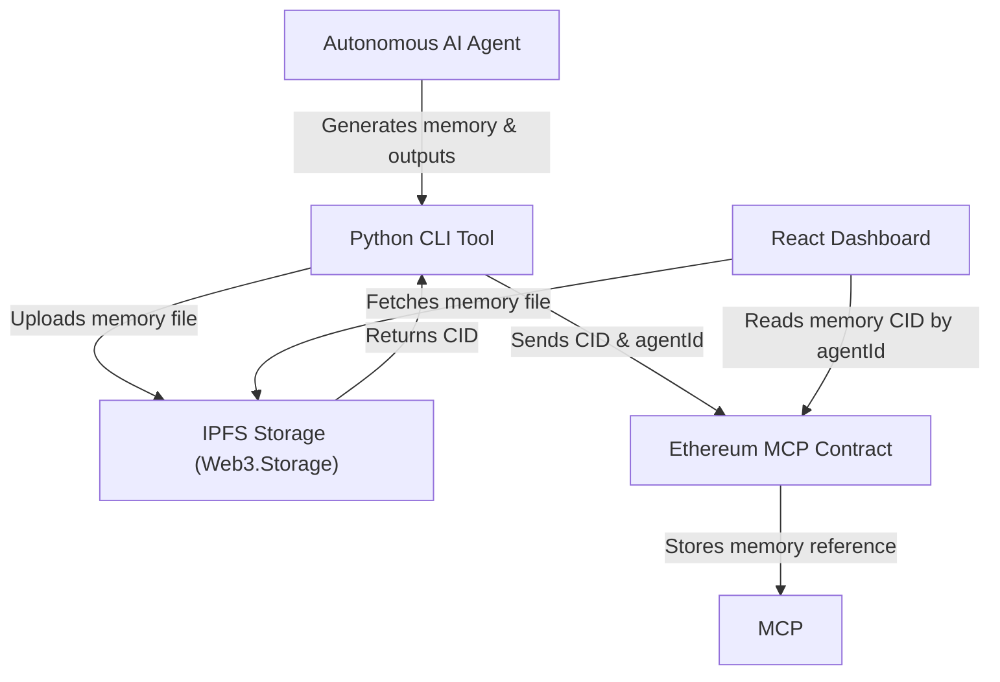

# 🚪 Encryptum: MCP-Powered AI-Native Decentralized Storage


Encryptum is a **decentralized storage protocol designed for AI-native systems**, enabling autonomous agents to securely store, verify, and share memory, states, and outputs.

This public repository contains all core components of Encryptum, including:

- **Smart contracts (Solidity):** The Model Context Protocol (MCP) for agent memory anchoring on Ethereum  
- **Python CLI tool:** Upload and sync agent memory to IPFS and Ethereum  
- **Frontend dashboard:** React app to explore agent states and memory  
- **Deployment scripts:** Hardhat scripts to deploy contracts on Ethereum testnets  
- **Tests and CI:** Automated tests and GitHub Actions for reliability

---

## 🌐 Live Demo

Try the Encryptum Agent Dashboard live:  
[https://app.encryptum.io/](https://app.encryptum.io/)

## 🔗 Useful Links

- Website: [encryptum.io](https://encryptum.io)  
- GitHub: [github.com/encryptumdev](https://github.com/encryptumdev)  
- X : [@encryptumio](https://x.com/encryptumio)

---

## 📊 Workflow Diagram



---

## 🔍 Why Encryptum is Open Source
Transparency and trust are essential for decentralized AI infrastructure. By open-sourcing Encryptum, we enable:

- Independent audits and security reviews

- Community-driven improvements and innovation

- Seamless integration and interoperability

- Collaboration across AI and blockchain ecosystems

---

## 🛠 Tech Stack
- Ethereum (Solidity smart contracts)

- IPFS via Web3.Storage

- Python CLI with Web3.py and Requests

- React frontend with Web3.js

- Hardhat for contract development and deployment

---

 ## ⚙️ Setup & Usage

### Prerequisites

- Node.js and npm installed  
- Python 3.8+ installed  
- Git installed  

### Clone and Setup

```bash
git clone https://github.com/encryptumdev/encryptum.git
cd encryptum
```
### Install Dependencies

Run the following commands to install the necessary packages for both the frontend and the Python CLI tool:

```bash
npm install           # Installs frontend and Hardhat dependencies
pip install -r requirements.txt  # Installs Python CLI dependencies
```
### Configure Environment Variables

Create a `.env` file in the root of your project and add the following keys. Replace the placeholder values with your own API keys and addresses:

```ini
WEB3_STORAGE_TOKEN=your_web3_storage_api_key
ETH_RPC=https://sepolia.infura.io/v3/YOUR_INFURA_PROJECT_ID
PRIVATE_KEY=your_ethereum_wallet_private_key
CONTRACT_ADDRESS=deployed_contract_address_after_deploy
```

---

### Deploy Smart Contract

Use Hardhat to deploy the Model Context Protocol contract to the Sepolia testnet:

```bash
npx hardhat run scripts/deploy.js --network sepolia
```
Copy the deployed contract address and update the `.env` and frontend config accordingly.

### Run Python CLI Tool

Store agent memory or interact with the protocol:
```bash
python cli/encryptum.py store-memory path/to/your/memory-file.txt
```

### Run Frontend Dashboard
```bash
cd client
npm start
```

---

## 🤝 Contribution

We warmly welcome contributions from the community to help improve Encryptum.  

If you would like to contribute, please follow these guidelines:

1. **Fork the repository** and create your feature branch (`git checkout -b feature/YourFeature`).  
2. **Make your changes** with clear, descriptive commit messages.  
3. **Test your changes** thoroughly to ensure stability and quality.  
4. **Submit a pull request** describing your changes and the problem they solve.  

Before contributing, please review our [Code of Conduct](./CODE_OF_CONDUCT.md) and [Contribution Guidelines](./CONTRIBUTING.md) to ensure a respectful and productive collaboration.

Together, we can build a stronger, more secure AI-native decentralized storage ecosystem.


---

## 📄 License

Encryptum is released under the [MIT License](./LICENSE), a permissive open-source license that enables broad use, modification, and distribution of the software.  

By choosing the MIT License, we encourage collaboration and innovation while protecting contributors and users with clear legal terms.  

For full license details, please refer to the [LICENSE](./LICENSE) file in this repository.
